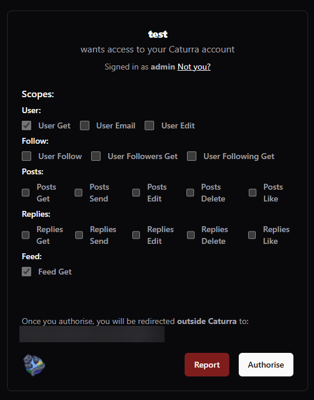

# Reports Guidelines

Developers should give users simple ways to report users or posts on their platforms, that could be a simple report button on the post or users page or within a context menu.\

<figure><figcaption>
Button Example
</figcaption></figure> <figure><figcaption>
Context Menu Example
</figcaption></figure>

When sending a user to the report page, make sure to send them to the correct URL.\
For user reports, send them to `/report/user/UUID` \
For post reports, send them to `/report/post/UUID` \
Replace the `UUID` of the user or post that wants to be reported\
\
To help make the user experience easier, we have provided a way for developers to redirect the user back to your site with a simple `?redirect_uri=` to the end of the URL, and once the user submits the report, they will be sent to the page you append to this.
